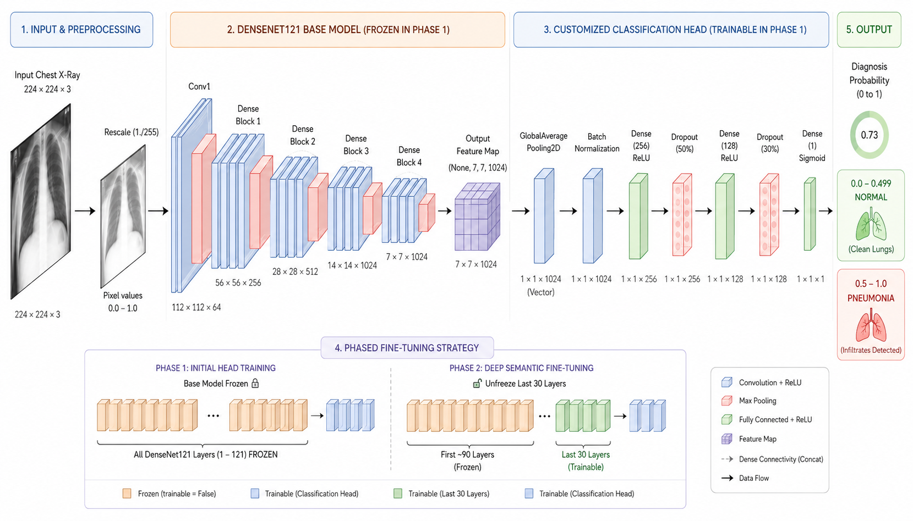

# 🩺 Automated Pneumonia Detection using Deep Learning

An AI-powered pneumonia detection system utilizing Pediatric Chest X-Ray images, a customized DenseNet121 Transfer Learning Architecture with Phased Fine-Tuning, and a full-stack Flask web application.

---

## 📌 Overview

This project focuses on detecting **Pneumonia from Chest X-Ray Images** using advanced **Deep Learning** and **Transfer Learning** strategies. 

Our system wraps a powerful CNN model in a **Flask web application** (serving both the backend API and frontend UI), allowing users to upload X-ray images and receive real-time, automated diagnosis.

---

## 🧠 Customized CNN Architecture using DenseNet121



Our model architecture is highly customized and relies on a two-phase training approach (Phased Fine-Tuning) to achieve exceptional diagnostic performance.

### 1. The Input & Preprocessing
- **Input Image:** 224x224x3 dimension RGB standard.
- **Preprocessing:** Rescaling (1./255) to bring pixel values into the `0.0` to `1.0` range. This is critical for stabilizing weight updates during gradient descent.

### 2. The Foundation: DenseNet121 Base Model
- **Base Model:** Pre-trained on ImageNet.
- **Role:** Sophisticated, fixed feature extractor that reliably recognizes edges, textures, and shapes.
- **Output:** Outputs a `(None, 7, 7, 1024)` feature map.
- **Phase 1 Training:** `base_model.trainable = False` (Frozen).

### 3. The Customized Classification Head
We built a tailored hierarchy to learn deep, medical-specific relationships:
- **GlobalAveragePooling2D:** Averages all 49 grid locations to figure out *what* features were found, outputting a `1x1024` vector.
- **Batch Normalization:** Normalizes activation values, keeping gradient descent smooth.
- **Dense Layer (256 Neurons, ReLU):** Maps general DenseNet features to deeper pneumonia-specific relationships.
- **Dropout (50%):** Severe regularization strategy. Forces redundant, robust pathways, preventing overfitting on the minority class.
- **Dense Layer (128 Neurons, ReLU):** Refines features into critical semantic patterns.
- **Dropout (30%):** Secondary regularization.
- **Final Prediction Dense (1 Neuron, Sigmoid):** Summarizes everything into one final probability score.

### 4. The Phased Fine-Tuning Strategy
Our training evolution provides a meta-view of learning:
* **Phase 1 (Initial Head Training):** Base model is completely frozen (`trainable = False`). Only the customized classification head is trained.
* **Phase 2 (Deep Semantic Fine-Tuning):** Early features (first ~90 layers) remain frozen. The **Last 30 Layers of DenseNet** are unfrozen (`trainable = True`). These deep layers adapt specifically to lung textures.

### 5. Output: Diagnosis Probability
Continuous probability score output:
- **0.0 to 0.499:** Normal Lungs 🫁
- **0.5 to 1.0:** Pneumonia Detected 🦠

---

## 🌐 Flask Web Application (Frontend & Backend)

To make our model accessible, we integrated it into a full-stack **Flask web application**:
* **Backend:** Flask routes handle image uploads, execute the preprocessing pipeline, and run inference using our trained customized DenseNet121 model.
* **Frontend:** A clean, user-friendly HTML/CSS/JS interface served via Flask templates, allowing medical professionals or end-users to upload X-rays and instantly view the diagnosis probability and results.

---

## 🛠️ Getting Started

### Prerequisites
- Python 3.9+
- `pneumonia_classifier.h5` (Model file)

### Installation
1. **Clone the repository:**
   ```bash
   git clone <repository-url>
   cd PneumoScan
   ```
2. **Set up a virtual environment:**
   ```bash
   python -m venv venv
   source venv/bin/activate  # On Windows: venv\Scripts\activate
   ```
3. **Install dependencies:**
   ```bash
   pip install -r requirements.txt
   ```

### Running the App
```bash
python app.py
```
The application will be available at `http://0.0.0.0:5000` (or `http://127.0.0.1:5000`).

---

## 📂 Dataset

- **Dataset Used:** Chest X-Ray Images (Pneumonia)
- **Source:** Kaggle
- **Total Images:** 5,863
- **Classes:** Normal, Pneumonia

---

## ⚙️ Main Techniques Used

* **Image Preprocessing:** Uniform resizing and normalization.
* **Transfer Learning:** Exploiting ImageNet weights for rapid convergence.
* **Phased Fine-Tuning:** Two-step freezing/unfreezing mechanism.
* **Double-Dropout Strategy:** 50% and 30% dropout layers for excellent regularization.

---

## 🛠️ Technologies Used

* **Web Framework:** Flask (Python)
* **Deep Learning:** TensorFlow / Keras
* **Data Processing:** NumPy, Pandas
* **Visualization:** Matplotlib, Scikit-learn
* **Frontend:** HTML, CSS, JavaScript (via Flask Jinja templates)

---

## 🚀 Future Improvements

* **Grad-CAM Visualization:** To highlight the exact infected regions on the X-ray on the web UI.
* **Real-time hospital integration:** API generation for healthcare systems.
* **Explainable AI support:** Providing detailed reasons for the diagnosis.

---

## 👨‍💻 Contributors

* **HIMANSHU MOURYA(23/EC/090)**
* **HARSHDEEP SINGH(23/EC/086)**
